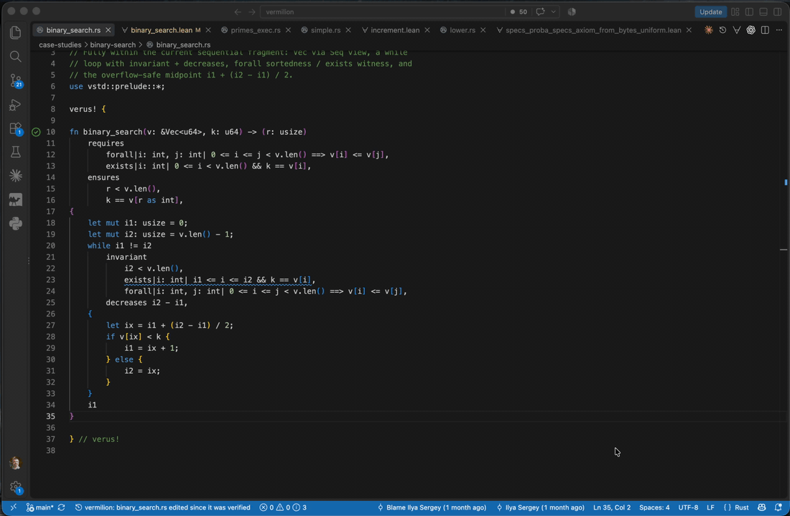

# Vermilion: Verified Rust Meets Lean

Vermilion is an experimental Lean 4 backend for the
[Verus](https://github.com/verus-lang/verus) verifier. It keeps Verus's Rust
front and middle end and translates VIR-SST verification conditions into
readable Lean theorem statements, with Lean as the only verifier.

- **100% Verus-compatible.** The input is unmodified Verus source. There is
  no Vermilion dialect and nothing to rewrite.
- **Kernel-checked theorems.** Every verification condition becomes a Lean
  theorem you can read, checked by the Lean kernel. The automation that
  proves it is itself untrusted.
- **Interactive proofs.** When automation fails, you write the proof
  yourself, in an editable Lean file that survives re-runs of the pipeline.
- **Lean-native automation.** Proof search uses `bv_decide`, `nlinarith`,
  and Mathlib lemma libraries; Verus's SMT encodings are not reproduced.
- **VS Code plugin.** A Dafny-style automated experience: verdicts appear on
  the offending Rust line, and ⌘⇧J (Ctrl+Shift+J) jumps from a Rust fact to
  its Lean counterpart and back.
- **Missing compared to Verus.** Ghost memory (`PointsTo`, raw pointers,
  cells), statics, and concurrency (atomics, tokenized state machines). The
  sequential feature set is complete; the rest is scheduled in
  [DESIGN.md](DESIGN.md).



**New here? Take the [hands-on tutorial](docs/TUTORIAL.md)** — verify
Rust through Lean, read the generated theorems, write an interactive
proof, and watch Lean report a broken program on its exact source line,
in about twenty minutes.

**What "verified" means here: [docs/trust.md](docs/trust.md).** Every
obligation is a Lean theorem checked by the Lean kernel; the automation
is never trusted. What *is* trusted — the translation and the embedding
conventions — is enumerated there, assumption by assumption, with the
argument for each and the differential guard that exercises it.


**Headline case study — [curve25519](case-studies/aeneas/curve25519/):**
curve25519-dalek's limb multiplication, body byte-identical to the one the
Aeneas project verifies, machine-checked by Lean end-to-end (38 obligations,
overflow-freedom included) **against the same specification** — a
kernel-checked `ring` bridge shows our per-limb contract implies their
`wideAsNat r = asNat a * asNat b` theorem. One verifier, two toolchains,
one spec.

## Status and roadmap

Everything about current support, blocked case studies, required features,
future ordering, and completed work is indexed here:

| Question | Authoritative place |
|---|---|
| Which acquired case studies are verified, partial, or blocked—and what blocks each one? | [Case-study registry](case-studies/README.md) |
| What did the sequential corpus teach us, function by function? | [Detailed case-study gap report](docs/reports/sequential-case-studies.md) |
| Which case studies should be acquired and supported next, in what order? | [Target-project ladder](docs/reports/target-projects.md) |
| How will Vermilion reproduce Aeneas's verified crypto results against the same Lean specifications? | [Aeneas reach assessment](case-studies/aeneas/README.md) and [crypto execution plan](case-studies/aeneas/PLAN.md) |
| What implementation work should happen next? | [Execution plan](plans/execution-plan.md) — unfinished queue first, completed appendix second |
| Which language/tool features have already landed? | [Progress ledger](docs/reports/progress.md) |
| Which concrete bugs and features are still open? | [Issue tracker](docs/issues/README.md), synchronized with GitHub |
| How does the system work, and what is trusted? | [Design](DESIGN.md), [pipeline](docs/pipeline/README.md), and [trust boundary](docs/trust.md) |
| Why was a decision made, and how can the result be reproduced? | [Session logs](logs/README.md) |

The separate [incrementality plan](plans/incremental-computation.md) records
the long-term computation and proof-reuse design.

The project is pinned to Lean 4.33.0, the Vermilion Verus fork at
`0bb5732ae6a`, Mathlib `v4.33.0`, and lean-smt `21aa44ce022f`. The sequential
Verus feature set is supported — generics, datatypes, quantifiers, `Vec`,
arrays, slices, `&mut`, traits, closures, const generics, broadcast lemmas,
mutual recursion, `for` loops — plus Lean-native specialty proving (`Bits`,
`nlinarith`, `by (compute)`, isolated `by (bit_vector)` and
`by (nonlinear_arith)` queries) and exact VIR machine-integer clipping, never
SMT-facing encodings. The differential corpus stands at 180/180 verdict parity
with 88/88 failure-span agreement. Verified case studies — Percolator (28
unchanged production functions) and the
[Aeneas crypto programme](case-studies/aeneas/README.md) (curve25519 limb
multiplication, ML-KEM `mont_mul`/`mod_reduce`, and the unchanged
AeneasVerif/sha3.rs scalar permutation layer at 198 obligations with no
`sorry`) — are tracked per-study in the
[case-study registry](case-studies/README.md).

**Active external benchmark — [dalek-lite](case-studies/dalek-lite/):** the
production curve25519-dalek fork with a complete in-source Verus verification,
and the benchmark crate of the CryptoProver paper. Vermilion is reproducing
that result with a strictly smaller trusted base — the Lean kernel instead of
Z3, and the crate's 48-`axiom_*` trusted floor progressively proved against
Mathlib. Feature slices DL1–DL7 have landed (per-function lowering isolation,
`choose`, the `calc!` macro-span fix, the Bits bridge, `assume_specification`
breadth, non-isolated loops, and a zero-drift vstd assessment); DL8 lowers and
emits the whole 9-module field cone (416/454 functions, ~5,215 clause-level
verification conditions), with the interactive VC fill under way and measured
against CryptoProver in the
[Layer Set A scoreboard](docs/reports/dalek-lite-layer-a-scoreboard.md).
The [status-and-roadmap index above](#status-and-roadmap) is the
single entry point for the registry, detailed blockers, future ladder,
execution queue, and completed-feature ledger.

## At a glance

**Supported from Verus today** (every construct verified by Lean, with
Verus-verdict parity measured on the differential corpus):

- straight-line code: `bool`, `int`/`nat`, all machine integer widths with
  overflow VCs, casts, lets, `assert`/`assume`, calls with contracts
  (assert `requires` / assume `ensures`), early returns —
  [examples/m1-pipeline](examples/m1-pipeline/README.md),
  [examples/m1-widening](examples/m1-widening/README.md);
- `if`/`else` with SSA joins and spec-level `ite` —
  [examples/m2-branches](examples/m2-branches/README.md);
- Lean class dictionaries required by theorem rendering are first-class
  `@[vrml_evidence]` obligations in the persistent twin. This bridges the
  executable Rust-`bool`/Lean-`Prop` distinction without silently making spec
  definitions classical; Percolator's `encode_bool` and compound `Result`
  gate are the first verified instances;
- `while`/`loop` with invariants and Verus's loop isolation, `decreases`
  measures, `break`/`continue` (incl. `invariant_except_break` and loop
  `ensures`) — [examples/m2-loops](examples/m2-loops/README.md),
  [examples/m2-break](examples/m2-break/README.md) — and recursive
  functions with termination checks —
  [examples/m2-recursion](examples/m2-recursion/README.md);
- range `for` loops (`for i in lo..hi` with invariants over the loop
  variable), specialized soundly from Verus's iterator desugaring —
  [examples/m2-forloop](examples/m2-forloop/README.md);
- user `spec fn`s — including recursive ones and
  `#[verifier::opaque]`/`reveal`/`reveal_with_fuel` —
  [examples/m2-specfns](examples/m2-specfns/README.md);
- vstd collections in spec positions: `Seq`, `Set`, `Map`, `Multiset`
  (core operations) —
  [examples/m2-collections](examples/m2-collections/README.md);
- user datatypes: structs, enums, tuples, `match` (as branch trees),
  constructors, field access, `is`-variant tests — emitted as real Lean
  inductives — [examples/m3-datatypes](examples/m3-datatypes/README.md);
- quantifiers: `forall`/`exists` as genuine `∀`/`∃` with range guards
  folded in; triggers preserved as metadata but not consumed by Lean —
  [examples/m3-quantifiers](examples/m3-quantifiers/README.md);
- spec closures and higher-order spec fns: `spec_fn(T…) -> U` values,
  closures, and application as genuine Lean functions —
  [examples/m3-closures](examples/m3-closures/README.md) — and exec
  closures with `requires`/`ensures` contracts, proved at each call —
  [examples/m3-exec-closures](examples/m3-exec-closures/README.md);
- traits with contracts (statically dispatched): trait spec fns, inherited
  requires/ensures proved at call sites and against impl bodies —
  [examples/m3-traits](examples/m3-traits/README.md);
- `&mut self` methods writing fields: record-update semantics through
  the prophecy contracts —
  [examples/m3-mut-fields](examples/m3-mut-fields/README.md);
- fixed-size arrays `[T; N]`: the `Seq` view with a const-generic
  length fact; literals, indexing, const-generic vstd spec fns —
  [examples/m3-arrays](examples/m3-arrays/README.md);
- mutually recursive spec fns: one Lean `mutual` block, fuel-coherent
  interleaved unfolding —
  [examples/m3-mutual-rec](examples/m3-mutual-rec/README.md);
- user `View` impls: `s@` on your own types through the impl's spec fn
  — [examples/m3-user-view](examples/m3-user-view/README.md);
- generic trait bounds (`fn f<T: Shape>`): the function verifies once
  over `T`, trait spec fns become universally quantified symbols, and
  the inherited trait contract applies at `Self = T` —
  [examples/m3-trait-bounds](examples/m3-trait-bounds/README.md);
- `broadcast proof fn` + `broadcast use`: the proven lemma's quantified
  fact injected at the use point, scoped like any fact —
  [examples/m3-broadcast](examples/m3-broadcast/README.md);
- const generics (`fn f<const N: usize>`): the parameter enters
  obligations as an `Int` binder with its `usize` range; instantiated
  calls substitute the literal —
  [examples/m3-const-generics](examples/m3-const-generics/README.md);
- generics: type parameters on functions, structs/enums, and spec fns —
  parameterized Lean inductives, verified once generically over abstract
  inhabited types — [examples/m3-generics](examples/m3-generics/README.md);
- exec `Vec<T>` via its `Seq` view: `v@`, `v@.len()`, `v@.index(i)`, the
  `v[i]` contract — [examples/m3-vec](examples/m3-vec/README.md) — and
  mutation: `Vec::new`, `v.push(x)`, exec `v.len()`, with extensional
  `Seq`/`Set`/`Multiset` equality as plain Lean `=` —
  [examples/m3-vec-mut](examples/m3-vec-mut/README.md);
- `&mut` parameters (sequential): `*old(x)`/`*final(x)` contracts, writes
  through the reference, and caller-side write-back through the callee's
  contract, including custom indexed destinations returned as `&mut` —
  Verus's prophecy encoding resolved at lowering time —
  [examples/m3-mutref](examples/m3-mutref/README.md);
- slices `&[T]` through their `Seq` view —
  [examples/m3-slices](examples/m3-slices/README.md);
- machine bit operations: `&`, `|`, `^`, shifts as `Vermilion.Bits`
  over `BitVec` — proved conversions and identity set, nothing trusted —
  and `by (bit_vector)` blocks as isolated queries —
  [examples/m4-bitvec](examples/m4-bitvec/README.md);
- nonlinear arithmetic: bounded-product goals on the `nlinarith`
  ladder rung — [examples/m4-nonlinear](examples/m4-nonlinear/README.md)
  — including truths stock Verus rejects without manual
  `by (nonlinear_arith)` hints —
  [examples/m4-beyond-verus](examples/m4-beyond-verus/README.md) — and
  explicit `by (nonlinear_arith)` blocks as isolated queries, exercised by
  the verbatim [IMO 1988 #6](case-studies/imo-1988-6/) and
  [power-of-2](case-studies/power-of-2/) studies;
- machine arithmetic retains VIR clipping: exact `nat` saturation, unsigned
  modulo `2^w`, and signed two's-complement interpretation; explicit wrapping
  builtins therefore differ correctly from mathematical `Int` arithmetic;
- `by (compute)`/`by (compute_only)`: ground evaluation via the
  shared middle's interpreter, fail-closed on false computations —
  [examples/m4-compute](examples/m4-compute/README.md);
- tooling: span-mapped `error[vermilion]` diagnostics
  ([examples/m1-diagnostics](examples/m1-diagnostics/README.md)),
  incremental fingerprints, watch mode, a VS Code extension (verify on
  save, gutter verdicts, jump-to-proof), and the ill-typed guarantee (a
  program the front end rejects never reaches the verifier).

**Not yet supported** (milestones in [DESIGN.md](DESIGN.md)):

- dynamic dispatch (`dyn`), `DeepView`, `choose`, quantifier-witness
  automation, const-generic datatypes, `&mut` returns (optional M3 tail);
- wider vstd collection APIs (union/filter/…; extensional `=~=` already
  lands as `=` for Seq/Set/Multiset), non-isolated loops
  (`loop_isolation(false)`);
- production-Rust gaps isolated by the Percolator study: generic `spec_from`
  reached by `?`, std `Ord::min/max` default-body contracts, indexed mutation
  through `&mut [T; N]`, fixed-width unary `BitNot`, and polymorphic
  constructor joins whose type is too ambiguous to identify an `Inhabited`
  target;
- standard `HashMap::entry` contracts (generic opaque views, returned `&mut`
  prophecies, owner mutation), acquired verbatim under `case-studies/entry-api`;
- globals/statics and their initialization semantics; the acquired statics
  study then requires M5 ghost memory and M6 atomic protocols;
- ghost memory: `PointsTo`, cells, invariants (M5); concurrency:
  tokenized state machines, atomics (M6); temporal/liveness reasoning
  (M7).

**Key design points:**

- **Lean is the only verifier.** Verus runs `--no-verify` as a front end;
  its SMT verdict is consulted only by the differential harness, as an
  oracle for parity measurement. Every corpus case runs through BOTH
  verifiers — Verus with its full SMT verification (the only place its
  Z3 verdict is consulted) and Vermilion with Lean judging — and the
  harness demands verdict *and* failure-span agreement, both
  directions. Where the correct verdicts deliberately differ, Vermilion
  is the *more complete* side: truths Verus's prover discipline rejects
  (trigger starvation; nonlinear arithmetic without `by
  (nonlinear_arith)` hints) verify here automatically —
  [examples/m4-beyond-verus](examples/m4-beyond-verus/README.md) is the
  living demonstration.
- **One boundary, fail-closed on both sides.** Rust lowers Verus's
  pre-poly SST to a small versioned textual IR ([docs/ir.md](docs/ir.md));
  Lean parses it with a real lexer/parser and owns VC generation (policy in
  [docs/vcgen.md](docs/vcgen.md)). Anything outside the fragment is an
  explicit error, never silent drift. The VC-bearing Lean files are
  produced by a four-stage Lean chain — parse (`Ir.Decode`), generate
  (`Ir.Vcgen`, obligations as data), render (`Ir.Render`, one theorem
  per VC), emit (`Ir.Emit`, change-detecting) — documented in
  [DESIGN.md](DESIGN.md)'s pipeline section.
- **No fuel, no definition axioms.** Spec functions become real Lean
  definitions (recursive ones via `termination_by` from the Verus-checked
  decreases); `reveal`/`hide` narrow each obligation's unfold hints, so
  Verus's visibility verdicts are reproduced without any fuel encoding —
  and nothing is added to the trusted base.
- **Machine attempts and human proofs coexist.** Every run regenerates
  `generated/` (machine statements + proof attempts) and reconciles the
  user-editable `proofs/` twin by statement hash: your proofs survive
  regeneration until the Rust changes their obligation; automation
  failures become `sorry` placeholders that are reclaimed when automation
  catches up. Class-valued evidence blocks use the same lifecycle and must be
  filled before the run can be green, even when downstream VCs pass
  contingently under their generated placeholders.

- **One Lean file per function.** By default each verified function gets
  its own generated unit module `generated/<stem>/<function>.lean`
  (`vrml_check` judges the units with parallel Lean processes), with the
  datatype declarations and spec-fn definitions emitted exactly once into
  the shared, imported `generated/<stem>/Specs.lean`. Which units import
  `Specs` follows from a reference analysis over each function's
  obligations (spec-fn applications, unfold lists, datatype mentions —
  callee contracts are already inlined by the call-graph-aware lowering).
  The classic single-module layout is one flag away (`--per-file`); the
  obligations, hashes, and verdicts are identical in both modes, and tools
  detect a directory's mode from its manifest.

### When does Vermilion generate `Decidable` evidence?

Only when a generated **logical VC** actually contains a proposition-valued
conditional that Lean cannot decide constructively. Concretely, the current
producer emits one module-local `(p : Prop) : Decidable p` obligation iff a
VC hypothesis or goal contains `Vermilion.iteP c thenValue elseValue` and its
structural analysis cannot obtain `Decidable c` from the explicit telescope.
It does **not** generate an instance merely because the Rust program contains
a `bool` or an `if`.

| Generated VC shape | Evidence? |
|---|---|
| No `iteP` occurs; an `if` only affects path conditions | No |
| `iteP` guarded by `True`/`False`, an integer comparison, constructively decidable Boolean combinations, or a generated datatype-variant predicate | No |
| `iteP value …` for a bare Rust `bool` represented as `value : Prop` | Yes |
| `iteP (unknown_predicate x) …` with no structural decision procedure | Yes |

The evidence is deduplicated: one universal dictionary serves all matching
theorems for that source (in the default per-function layout it is a shared
`Evidence.lean` unit; under `--per-file` it sits inside the single module).
It is emitted after spec-function definitions, so it cannot silently make
those definitions classical. The
generated placeholder is never enough for a green result; its body must be
filled and kernel-checked in the persistent twin. The smallest example is
[Percolator's `encode_bool`](case-studies/percolator/encode_bool_decidable.rs),
with its solution in the
[Lean proofs twin's evidence unit](case-studies/percolator/proofs/encode_bool_decidable/Evidence.lean).
The normative rule is in
[the VC-generation specification](docs/vcgen.md#typeclass-evidence-obligations).

## Build and test

Everything (Rust workspace, pinned Verus — our fork `ilyasergey/verus`
branch `dev`, cloned automatically on first run — direct SST adapter, and
the Lean libraries) builds with one command:

```console
./scripts/build.sh
```

To reuse an existing Verus checkout instead of the automatic clone, set
`VERUS_CHECKOUT=/path/to/verus`.

The test suite has three scopes. The full gate — Rust tests, every example,
every case study, emission determinism, the incrementality matrix, the
ill-typed and interactive-evidence lifecycle guarantees, the twin-library
build, and the differential corpus against Verus-as-oracle (with a live
progress bar) — is one command:

```console
./scripts/run_suite.sh
```

While iterating, the fast loop is the smoke scope — unit tests, all
examples, emission determinism, and the pipeline contracts, skipping the
case studies, the twin-library build, and the differential corpus:

```console
./scripts/run_suite.sh --smoke
```

Each case study also runs by itself (all of its runners, including a
study's source-preservation guard and probe suites where it has them):

```console
./scripts/run_suite.sh --list-case-studies   # the valid names
./scripts/run_suite.sh --case-study dalek-lite
./scripts/run_suite.sh --case-study aeneas/sha3
```

The Verus conformance suite — the differential corpus, where every case
runs through BOTH verifiers (Verus with its full SMT verification, the only
place its Z3 verdict is consulted, and Vermilion with Lean judging) and the
harness demands verdict *and* failure-span agreement in both directions —
also runs by itself, with a live progress bar:

```console
./scripts/run_suite.sh --differential
```

For an interactive edit loop outside the editor, keep one source under
watch (re-judges only hash-changed obligations, ~3.6 s per edit):

```console
./scripts/vrml_watch.sh examples/m1-pipeline simple.rs
```

### Issue tracker (synced with GitHub issues)

The feature backlog and bug/fix log live as one Markdown file per issue in
[`docs/issues/`](docs/issues/README.md) (closed issues under
[`docs/issues/closed/`](docs/issues/closed/)); each file **is** a GitHub issue.
[`scripts/sync_issues.py`](scripts/sync_issues.py) keeps the files and the
issues in step **both ways** — edit locally and push, or file/close an issue on
GitHub and pull it into the tree (which moves the file between the open and
`closed/` folders):

```console
./scripts/sync_issues.py --dry-run   # preview a two-way sync, change nothing
./scripts/sync_issues.py             # two-way sync (auto-picks direction per file)
./scripts/sync_issues.py --push      # only publish local files -> GitHub
./scripts/sync_issues.py --pull      # only fetch GitHub -> local files
```

A file changed on both sides since the last sync is reported as a conflict and
left untouched; closing/reopening moves the file between the top level and
`closed/`. Format and mechanics are documented in
[`docs/issues/README.md`](docs/issues/README.md).


## What we add to the Rust sources (and what we never touch)

Case studies take executable bodies **verbatim** — algorithms are never
modified. What Vermilion adds is specification text only:

- **Contracts** (`requires`/`ensures`, result binders) and **loop
  invariants** — Verus syntax around and inside unchanged bodies.
- **Spec-only items**: e.g. for custom `Index` sugar
  (curve25519-dalek's `Scalar52[i]`), an
  `impl vstd::std_specs::core::IndexSpecImpl<usize> for T` supplies the
  inherited `requires` of the `Index` impl, and the impl declares its
  own `ensures` — Verus's restriction is requires-only-inherited;
  impl-level `ensures` are accepted and give callers the returned
  value. See [case-studies/aeneas/curve25519](case-studies/aeneas/curve25519/).
- **Nothing else.** `debug_assert!`s in production code (SymCrypt) are
  consumed as statically checked assertions by our Verus fork — proof
  obligations, not trusted assumptions.

## Case studies — verified, blocked, and planned

Beyond the feature demos, Vermilion tracks self-contained programs lifted
**verbatim** from the Verus repository, external Rust production bodies, and
explicit research targets. Acquired runnable studies live under
[`case-studies/`](case-studies/README.md), with a provenance README and a
`proofs/` twin wherever Lean obligations are generated.

The complete, authoritative table — including acquired-but-blocked studies
and the exact feature each one still needs — is the
[case-study registry](case-studies/README.md). The table below is the shorter
top-level tour.

| Study | Current result or boundary |
|---|---|
| [`imo-1988-6`](case-studies/imo-1988-6/) | verbatim Vieta-jumping proof; 67 Lean obligations (66 automatic + 1 interactive), including isolated nonlinear assertion queries |
| [`power-of-2`](case-studies/power-of-2/) | verbatim recursive `pow2`/`u32` shift development; 57 obligations (40 automatic + 17 interactive), exact wrapping clips |
| [`entry-api`](case-studies/entry-api/) | verbatim `HashMap::entry` progression; Verus 3/3, currently fail-closed on generic opaque spec applications, then returned-`&mut` Entry contracts |
| [`statics`](case-studies/statics/) | verbatim static atomic counter + verified `Lazy<T>` protocol; Verus 9/9, deliberately blocked until globals, ghost memory, and atomics have Lean semantics |
| [`percolator`](case-studies/percolator/) | 28 unchanged function bodies from a `no_std` perpetual-futures risk engine: policy/Boolean/`Result` gates, persistent enum codecs, active-bitmap reads, saturating multiplication, and U256 construction/readback/bitwise operations; 97 logical-or-evidence Lean obligations, plus an exact whole-`wide_math.rs` boundary |
| [`recursion`](case-studies/recursion/) | investigation target rather than a green gate: its clean recursive core lowers, while the tutorial deliberately mixes negative examples with unsupported `decreases_to!` and `via`/`#[via_fn]` termination proofs |
| [`dalek-lite`](case-studies/dalek-lite/) | the CryptoProver benchmark crate (curve25519-dalek with a complete in-source Verus verification, ~105k LOC) — acquired at `de9ebf015` with a measured probe matrix: the u128 widening core, `assume_specification` external-type models, and `let ghost` verify (11 obligations, one interactive); `choose`, non-isolated loops, and a `calc!` colocation defect are the measured blockers behind the [DL agenda](case-studies/dalek-lite/PLAN.md) |
| [Aeneas-derived verified crypto](case-studies/aeneas/) | curve25519 and separate SymCrypt scalar arithmetic probes verify their named specifications; the complete pinned standalone [`AeneasVerif/sha3.rs`](case-studies/aeneas/sha3/) project—not SymCrypt SHA-3—is tracked in pristine and annotated copies. Its unchanged scalar implementation through `copy_to` verifies as 198 Lean obligations in 25 twins with no `sorry`, while the source guard erases 86 typed regions back to pristine Rust. Absorb/squeeze, sponge, six public functions, and the exact external bridge are open; public parity is 0/6 |
| [`merge-sort`](case-studies/merge-sort/) | merge sort on `Vec<u64>` (sorted permutation) — the **verbatim** upstream with all its inline SMT scripting (43 automatic + 17 interactive) *and* a specs-only variant (31 + 9); `test.sh` runs the verified sort |
| [`primes`](case-studies/primes/) | number theory (multi-file): spec-level `is_prime` + a trial-division `test_prime` proved to refine it |
| [`sorting`](case-studies/sorting/) | `sort_by` / `sorted_by` / `lemma_sorted_unique` and multiset equivalence over a comparator |
| [`binary-search`](case-studies/binary-search/) | binary search over a sorted `Vec` (existential-witness invariant) |
| [`vec-reverse`](case-studies/vec-reverse/) | in-place `Vec` reversal (swap-permutation invariant) |
| [`vec-uninterp`](case-studies/vec-uninterp/), [`vec-pop-uninterp`](case-studies/vec-pop-uninterp/) | `Vec` push/pop preserving an uninterpreted predicate |

The staged ladder of what we verify next — Verus-corpus studies and external
projects — is [docs/reports/target-projects.md](docs/reports/target-projects.md);
the crypto-specific Aeneas comparison has its own
[evidence-backed execution plan](case-studies/aeneas/PLAN.md).

## Feature examples

Each example is driven by its own script, with **Lean as the only verifier**
(Verus runs as a front end under `--no-verify`):

```console
./examples/m1-pipeline/run.sh      # golden slice
./examples/m1-widening/run.sh      # widened fragment
./examples/m1-diagnostics/run.sh   # deliberate failure, span-mapped by Lean
./examples/m2-branches/run.sh      # if/else joins, early returns, spec ite
./examples/m2-loops/run.sh         # while + invariants; manual twin proof
./examples/m2-break/run.sh         # break/continue, loop ensures
./examples/m2-recursion/run.sh     # decreases measures
./examples/m2-forloop/run.sh       # range for loops (for i in lo..hi)
./examples/m2-collections/run.sh   # vstd Seq/Set/Map/Multiset in specs
./examples/m2-specfns/run.sh       # user spec fns as real Lean defs
./examples/m3-datatypes/run.sh     # structs/enums as real Lean inductives
./examples/m3-quantifiers/run.sh   # forall/exists; interactive twin proofs
./examples/m3-generics/run.sh      # type parameters (generics)
./examples/m3-vec/run.sh           # exec Vec<T> via its Seq view (read-only)
./examples/m3-mutref/run.sh        # &mut params: old/final prophecy contracts
./examples/m3-vec-mut/run.sh       # Vec mutation: new/push/len contracts
./examples/m3-traits/run.sh        # trait contracts, static dispatch
./examples/m3-closures/run.sh      # spec closures, higher-order spec fns
./examples/m3-exec-closures/run.sh # exec closures with contracts
./examples/m3-const-generics/run.sh # const N: usize parameters
./examples/m3-broadcast/run.sh     # broadcast lemmas at their use sites
./examples/m3-trait-bounds/run.sh  # generic fns under trait bounds
./examples/m3-user-view/run.sh     # user View impls (s@ on your types)
./examples/m3-mutual-rec/run.sh    # mutually recursive spec fns
./examples/m3-arrays/run.sh        # fixed-size arrays [T; N]
./examples/m3-mut-fields/run.sh    # &mut self field writes
./examples/m3-slices/run.sh        # slices &[T]
./examples/m4-bitvec/run.sh        # bit ops via the Bits library
./examples/m4-nonlinear/run.sh     # nonlinear arithmetic rung
./examples/m4-beyond-verus/run.sh  # true + automatic here; stock Verus rejects
./examples/m4-compute/run.sh       # by (compute) ground evaluation
```

Every `run.sh` accepts `--clean-env` (fresh slate for that example's machine
artifacts; your `proofs/` twin is never touched) and `--help`. Failures
print colored, clickable diagnostics with concrete next steps; goals you
prove by hand in the twin are reported in green as *discharged
interactively*.

## VS Code extension

Install once and reload VS Code:

```console
./scripts/install_vscode_extension.sh
```

Then, in any example's `.rs` file:

- **saving re-verifies the file** silently in the background (or press
  ⌘⇧R / Ctrl+Shift+R); while a run is in flight the affected functions
  show a trembling zigzag in the gutter, Dafny style;
- verified functions get a **circled green checkmark** on their `fn`
  line; failing ones a circled red ✗, with red squiggles at the exact
  Rust spans;
- one shortcut jumps from Rust to the Lean side — **`⌘⇧J` /
  `Ctrl+Shift+J`** (scoped to Rust files, so it shadows nothing),
  context-aware (*Vermilion: Go to Lean*, also in the right-click menu):
  on any **`assert`**, **`ensures`**, or **invariant** clause it lands at
  the start of that VC's Lean proof (its tactic body, where you edit —
  whichever obligation's Rust span the cursor is in, passed or not); when
  a construct maps to **several VCs**
  (e.g. a loop invariant's entry and preserve checks), it offers a picker
  listing each VC by theorem name, status (auto / interactive / unproven
  `sorry`), and goal. **Anywhere else in a function** it goes to the
  function's Lean counterpart — a `proof fn`/`fn` to its first obligation
  theorem, a `spec fn` to its emitted Lean definition. The same shortcut
  works **in reverse**: inside a generated/twin `.lean` file, `⌘⇧J` in an
  obligation's block (*Vermilion: Go to Rust*) jumps back to that VC's
  exact position in the Rust source. It opens in the
  same editor group;
- every failed or interactively-proven goal also links into the `proofs/`
  twin from the Problems panel;
- files that do not type-check never reach the verifier: the rustc
  errors are highlighted at their spans instead;
- files that are valid Verus but use an unsupported Vermilion construct show
  a persistent **outside the supported fragment** status. If the refusal is
  in an imported declaration, the matching Rust `use` target is highlighted
  and links to the dependency's exact span; all functions are marked
  unsupported because no per-function obligations were emitted;
- the status bar tracks the active file: spinner while verifying, then
  `✓ fully verified`, `✗ N failed`, or the explicit fragment warning;
- **results appear as soon as you open a file, without re-running.** Verdicts
  are read from the artifacts on disk, so a file that was judged before — by an
  earlier session, another window, or (for a vendored source) the study's own
  driver — is highlighted immediately. A verdict older than the source it
  judged is reported as such (`vermilion: <file> edited since it was verified`)
  and its checkmarks are withheld, rather than shown as if current;
- **macro-generated items get marks at their invocation.** Lemma factories
  (`macro_rules!` bodies declaring `pub proof fn $name`) have no `fn <name>` in
  the source, so their obligations' spans point at the macro invocation; the
  mark lands there. curve25519-dalek's `shift_lemmas.rs` shows 68 such
  checkmarks, one per generated lemma;
- **vendored case-study sources navigate too.** A study that verifies an
  upstream crate lowers a whole dependency cone: the obligations come from
  `.rs` files deep inside the (gitignored) checkout, while every manifest
  lands under the study's `generated/`. Opening such a file — e.g.
  curve25519-dalek's `src/lemmas/common_lemmas/bit_lemmas.rs` — resolves its
  manifest by walking up to the owning study, so `⌘⇧J` jumps to the Lean
  obligations as usual. Those files are crate members rather than
  self-contained programs, so saving one does *not* trigger a doomed
  standalone run; their verdicts come from the study's own driver
  (`case-studies/<study>/run.sh`). rust-analyzer is kept out of the vendored
  trees (`.vscode/settings.json`): inside `verus! { … }` they are not Rust,
  so it could only report false errors.

Opening the generated/proofs `.lean` files is fast (~0.5 s): the repo
ships a caching `lake` shim (`editor/bin/lake`, wired via
`.vscode/settings.json`) that spares the Lean server Lake's per-package
git scans. Every registered `proofs/` library discovers its exact first-level
module roots automatically, and the shim refreshes Lake's compiled root list
when that set changes. Generated stems anywhere in the repository are
activated through a disposable on-demand overlay, so sibling `Specs.lean`
imports cannot be captured by the wrong generated tree. A new proof stem needs
no per-stem `lakefile.lean` edit; a wholly new proof source tree is registered
with one command — `./scripts/register_proof_lib.py register <CaseName>
<proofs-dir>` (idempotent; the suite's `scan` phase fails on any
unregistered tree) — because Lake and the runners still need
one named library declaration so Lake and runners have an unambiguous owner.
The Lean infoview elaborates your twin proofs live as you edit them.

## Progress

Vermilion has taken the sequential Verus fragment through milestones M1–M4
plus the vstd-mirror work (V1–V4); the differential corpus stands at
**180/180 verdict parity** with Verus-as-oracle and 88/88 failure-span
agreement. The full milestone-by-
milestone ledger lives in
[docs/reports/progress.md](docs/reports/progress.md).

See the [M1 example](examples/m1-pipeline/README.md) and
[pipeline documentation](docs/pipeline/README.md). The complete research and
architecture report corpus is available as a
[ported planning snapshot](docs/planning/PORTING.md).

Artifacts are colocated by source name: `simple.rs` yields the machine's
statements and proof attempts under `generated/` (recreated every run) and
their user-editable twins under `proofs/`, reconciled by `vrml_sync`:
byte-identical to `generated/` while automation succeeds, `sorry` with a
warning where it fails, and your hand-written proofs survive regeneration
until the Rust changes their obligation. In the default per-function layout
that means one unit module per function (`generated/simple/<function>.lean`
twinned by `proofs/simple/<function>.lean`) around the shared
`Specs` module; `--per-file` collapses everything into the classic single
`generated/simple.lean` / `proofs/simple.lean` pair. Start with the
[hands-on tutorial](docs/TUTORIAL.md).

## Contributors

See [CONTRIBUTORS.md](CONTRIBUTORS.md).
